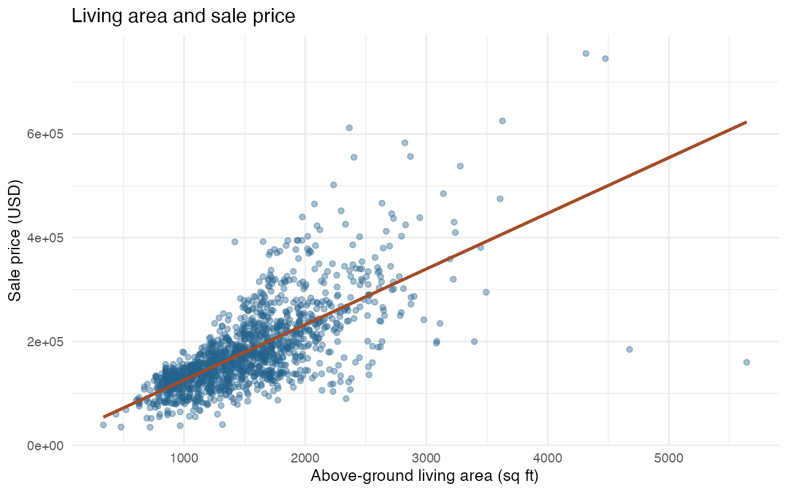

# Housing market analysis

**Ruoxi (Rachel) Liu | August 2026–present | Ongoing**

An R project exploring how housing quality, living area, and neighborhood relate to sale prices in 1,460 Ames residential sales. It combines transparent missing-data rules, exploratory visualization, categorical feature engineering, and a simple regression benchmark.

## Results at a glance

- 1,460 observations, 81 fields (including the record ID and target), and 25 neighborhoods.
- 6,606 structural missing entries recoded across 14 categorical fields; absence of an amenity is distinguished from unknown information.
- Pearson correlations with sale price: approximately 0.791 for overall quality and 0.709 for above-ground living area.
- A September 2026 six-predictor log-linear benchmark achieved exploratory test RMSE **$28,537**, MAE **$19,920**, and R² **0.843** on 292 observations. The training-mean baseline RMSE was $72,099.



## What is original and what was added

The supplied August 31, 2026 R Markdown contains data cleaning, exploratory charts, correlation screening, and a 15-feature categorical design matrix. `Housing 1.Rmd` is a portable, edited version of that notebook. The Word report explains the eight original charts.

The September 21, 2026 portfolio revision adds a runnable analysis script, audit tables, saved figures, a reproducible split, and the regression benchmark. Code and editorial revisions were developed with AI assistance. New results are not backdated to the original project.

## Reproduce

Use R 4.5 or later. From the repository root:

```r
source("scripts/setup.R")
source("scripts/run_analysis.R")
# Optional full notebook; requires Pandoc (included with RStudio):
rmarkdown::render("Housing 1.Rmd", output_dir = "reports")
```

Obtain the competition training file from [Kaggle House Prices](https://www.kaggle.com/competitions/house-prices-advanced-regression-techniques/data) and save it as `data/train.csv`. The local package includes the user-supplied copy; raw data are excluded from Git tracking. The fields and record count match this competition's Ames training format.

Outputs are written to `results/` and `figures/`. `results/session_info.txt` records the execution environment. The script checks dimensions, IDs, required model inputs, and split membership.

## Interpretation and limitations

This is observational analysis. Correlations and regression coefficients are not causal effects. Existing exploratory work used the full dataset, so the later random 80/20 split is an **exploratory benchmark**, not an untouched external validation set. Six numeric predictors were specified explicitly; this is not a tuned competition model. The split uses seed 20260921; exponentiation uses a smearing factor estimated only from training residuals. No large houses were automatically deleted as errors.

Garage construction year is not applicable when no garage exists. High correlation between garage area and garage capacity signals overlapping information, not automatically unacceptable multicollinearity. The four-car garage group contains only five observations.

## Next steps

- Validate model choices with repeated or nested cross-validation and, where appropriate, temporal splits.
- Evaluate the categorical design matrix without leaking preprocessing across evaluation folds.
- Examine residuals, influential observations, and prediction uncertainty.
- Confirm the dataset license before redistributing raw observations.

## Files

- `Housing 1.Rmd`: revised original notebook.
- `scripts/run_analysis.R`: audit, figures, and benchmark.
- `reports/housing 1.docx`: edited interpretation of original charts.
- `results/`: reproducible numerical outputs.
- `figures/`: selected charts for quick review.
